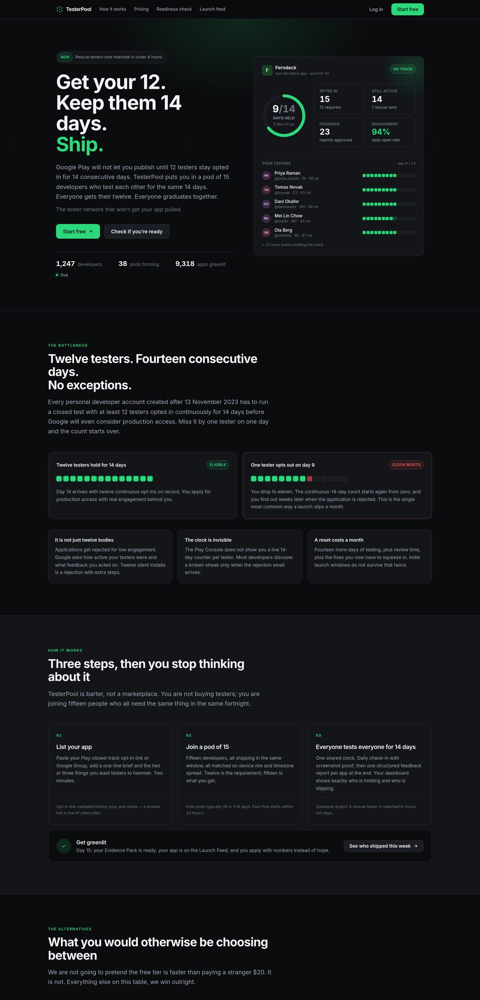
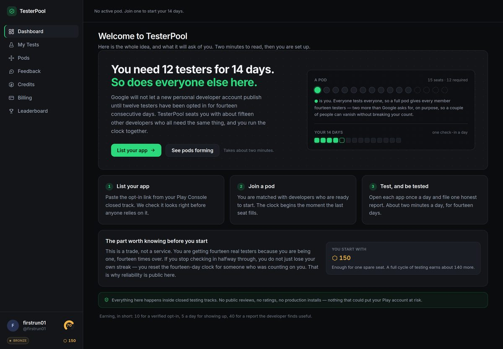
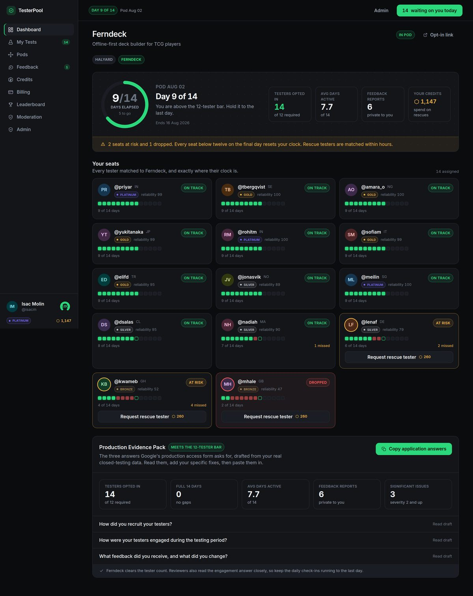
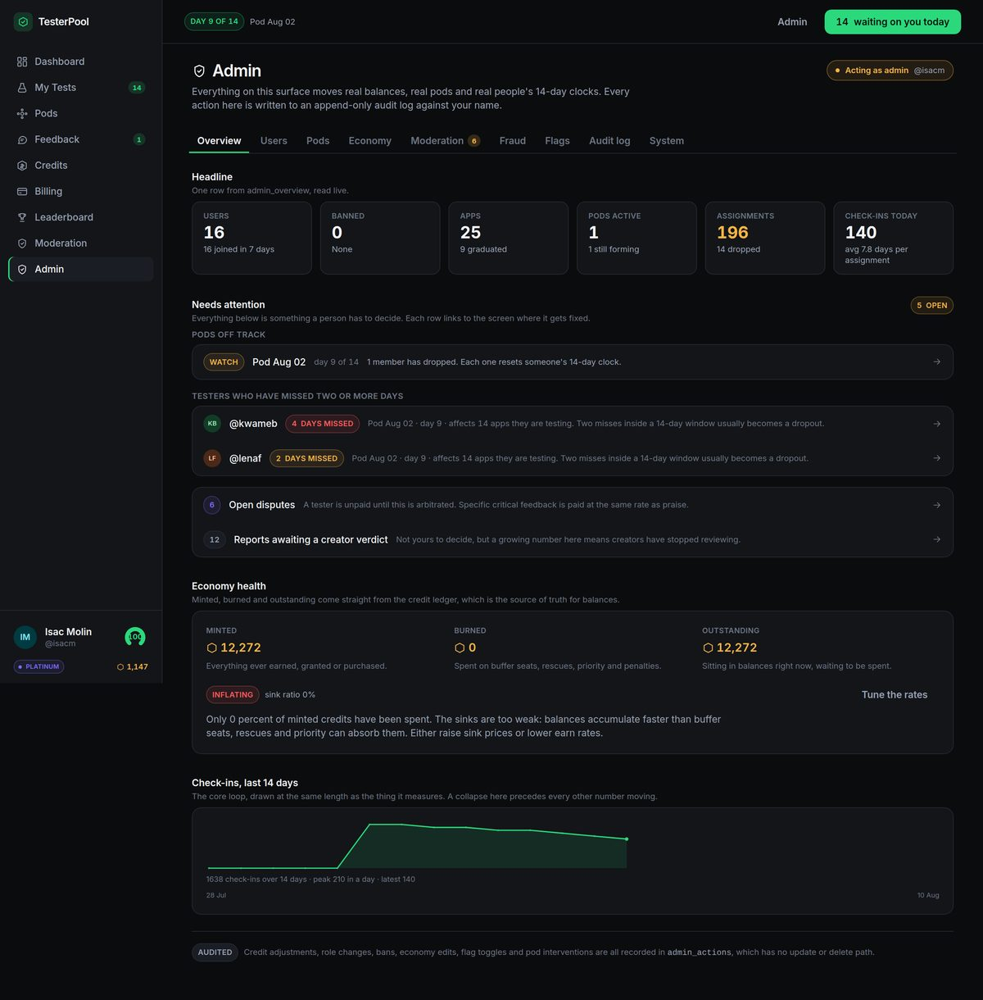

# TesterPool

**Get your 12. Keep them 14 days. Ship.**

Google Play will not let a new personal developer account publish until twelve testers have been
opted in for fourteen consecutive days. TesterPool seats you with about fifteen other developers
who all need the same thing, and you run the clock together.

Everything happens inside closed testing tracks, which affect no store ranking, rating, or public
install count. There are no public reviews, no ratings and no production installs anywhere in this
product, by design and at the schema level.



## The idea in one screen

A pod is about fifteen developers who all test each other's apps across the same fourteen days.
Everyone gets their twelve. Everyone graduates together. The new-user screen says so before you
sign up for anything.



The creator dashboard is the whole product on one page: a live day counter, every tester's
fourteen-day streak, seats that are drifting, and the Production Evidence Pack that drafts
Google's three application answers from your real data.



There is an operator surface too — user and pod control, live economy tuning, feature flags,
fraud signals, an append-only audit log, and a system health page that tells you whether the
scheduled jobs are actually running.



More in [`screenshots/`](screenshots).

## Documentation

```
docs/STRATEGY.md      Research, competitor teardown, economy design, growth loops
docs/BUILD-PLAN.md    Stack, services, costs, phased roadmap, metrics
docs/AUTH-SETUP.md    Google, GitHub and Apple sign-in — step by step
docs/OPERATIONS.md    The scheduled jobs, health checks, secrets, cost profile
docs/PAYMENTS.md      Stripe setup, webhooks, idempotent fulfilment, payment methods
design/               Standalone design system + 11 screen mockups (open in a browser)
app/                  Next.js 16 + Supabase application
shots/                Screenshots of the running app
```

## Run it

```bash
cd app
cp .env.example .env.local     # Supabase URL + anon key at minimum
npm install
npm run dev                    # http://localhost:3000
```

Visit `/demo` to sign in as any seeded developer — they are all in a pod at day 9 of 14, so every
screen is populated. Sign in as Isac Molin to see the admin dashboard and moderation queues.

The app boots and works with nothing but the two Supabase variables set. Stripe, Resend and the
vision API are all optional; each one degrades honestly rather than failing, and `/admin/system`
tells you which are configured.

## What is built

The developer surface: onboarding, pod matching, the verified opt-in wizard, daily check-ins with
screenshot proof, structured feedback with arbitration, credits and referrals, leaderboards, public
profiles, and the Production Evidence Pack that drafts Google's three application answers from your
real closed-testing data.

The public surface: landing page, a free production-access readiness checker, the launch feed, and
Greenlight share pages with server-rendered social images.

The operator surface: an admin dashboard with user and pod control, live economy tuning, feature
flags, fraud signals, an append-only audit log, and a system health page; plus four scheduled jobs
and two edge functions that run the whole thing without anyone watching.

## The three rules the codebase enforces

1. **No credit ever attaches to a public store action.** No table, column or enum can represent a
   public review, a public rating, or a production install. Keep it that way.
2. **A creator can never silently withhold payment for critical feedback.** A "low effort" verdict
   opens a moderator dispute instead of rejecting the report.
3. **`profiles.credits` is a projection of `credit_ledger`.** A database trigger rejects any write
   that does not go through `award_credits()` or `spend_credits()`.

## Before launch

`docs/BUILD-PLAN.md` Phase 0. Short version: delete `src/app/demo/`, remove the demo accounts,
rotate the anon key, enable Supabase leaked-password protection, add Turnstile to signup, and write
Terms that do not contradict the product.
